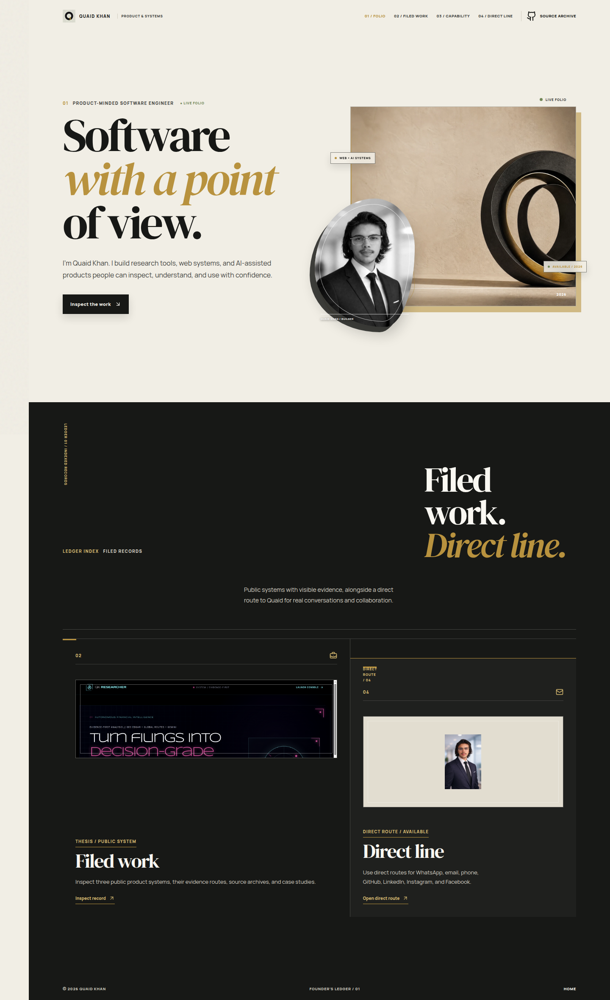
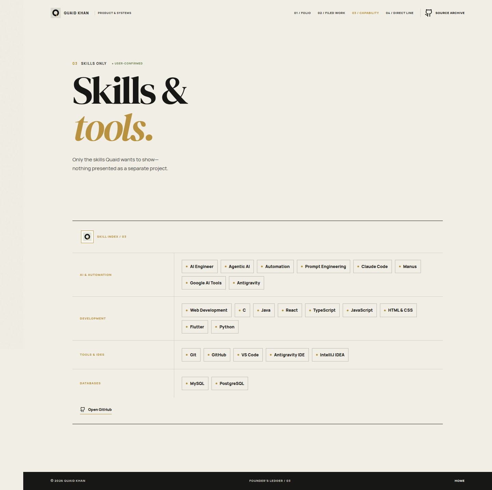

# Quaid Khan — Portfolio

> A multi-page personal portfolio for **Quaid Khan**, presenting public work, practical skills, direct contact routes, and a visual portfolio CV.

[**View the live portfolio**](https://quaidfolio-rnfjckkg.manus.space)

## Preview

### Home



### Skills



## What is included

| Area | Details |
|---|---|
| **Multi-page experience** | Dedicated Home, Work, Skills, and Contact routes. |
| **Public work** | Links to live products, source repositories, and case-study PDFs where available. |
| **Skills** | A user-confirmed list of AI, development, IDE, and database tools. |
| **Contact** | Direct GitHub, LinkedIn, Instagram, Facebook, email, phone, and WhatsApp routes. |
| **Responsive design** | Mobile-ready layouts and navigation. |

## Technology

The portfolio uses **React 19**, **TypeScript**, **Vite**, **Tailwind CSS**, **Framer Motion**, and **Lucide icons**.

## Run locally

```bash
pnpm install
pnpm dev
```

To create a production build:

```bash
pnpm build
```

## Project structure

```text
client/src/pages/       # Home, Work, Skills, and Contact pages
client/src/components/  # Shared layout and UI components
client/src/index.css    # Portfolio visual system and responsive styles
docs/screenshots/       # Authentic portfolio previews used in this README
```

## Deployment note

The live portfolio is deployed on Manus. Visual assets are served through managed Manus storage URLs that are referenced directly in the source.

## Contact

Use the live portfolio’s Contact page to reach Quaid directly.
